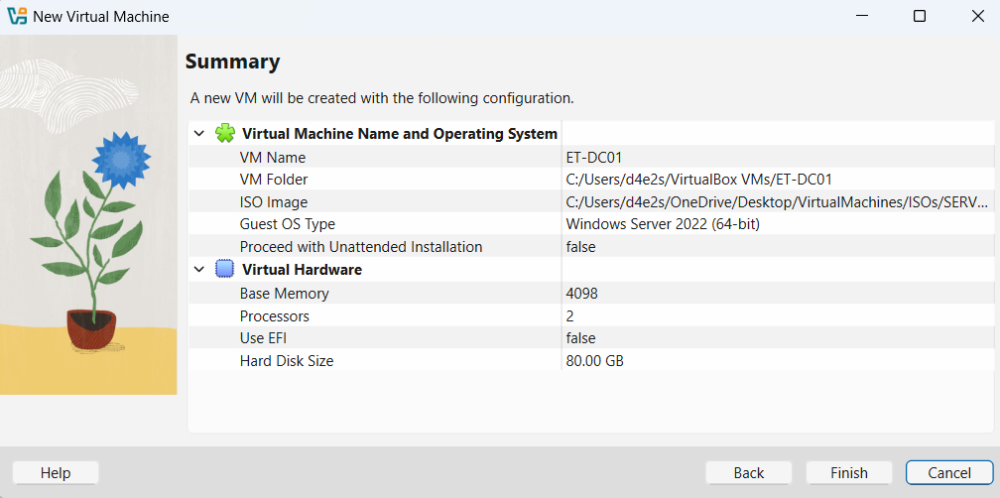
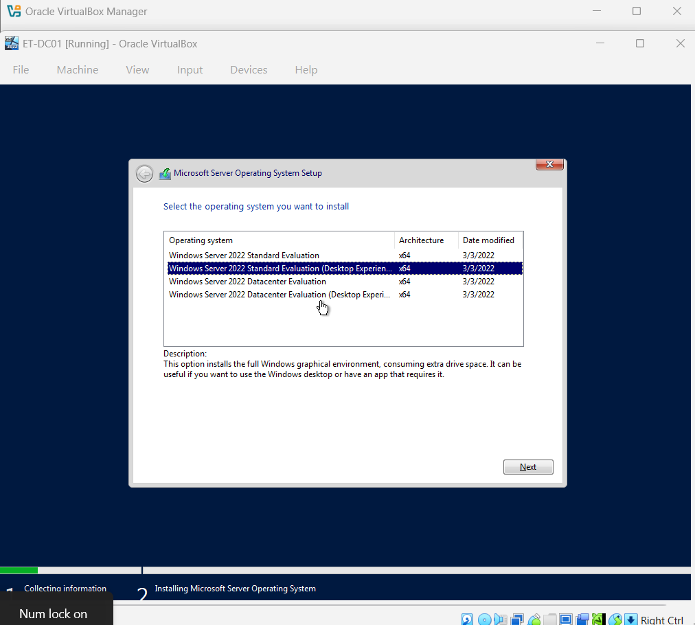
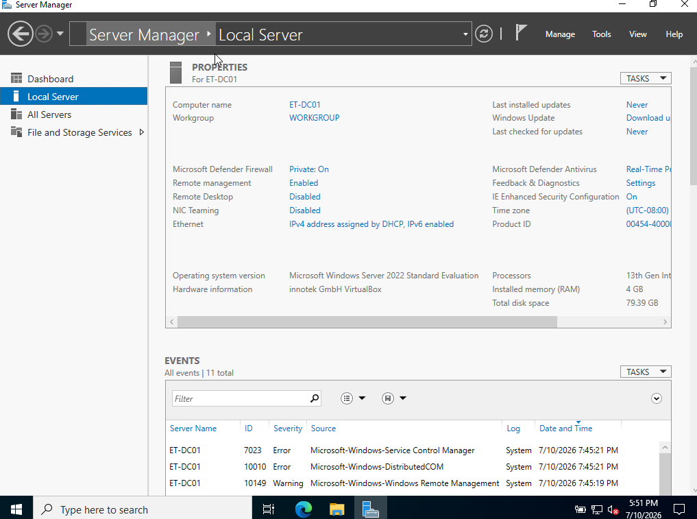

## Installation Steps

### Phase 1: Virtual Machine Creation
1. Open VirtualBox and click **New**.
2. Name the VM `ET-DC01`, select your Windows Server 2022 ISO, and check **Skip Unattended Installation**.
3. Allocate **4 GB RAM** and **2 vCPUs**.
4. Create a **80 GB Dynamic Virtual Hard Disk**.
5. On the final Summary screen, pause. 
   > 📸 **SCREENSHOT #1:** Capture the VirtualBox Summary window showing your hardware configurations before clicking **Finish**. (Save as `01-vm-summary.png`)

### Phase 2: Operating System Setup
1. Start the VM and press any key to boot from the ISO.
2. Select your language preferences and click **Install Now**.
3. When prompted to select the operating system, highlight **Windows Server 2022 Standard Evaluation (Desktop Experience)**.
   > 📸 **SCREENSHOT #2:** Capture the OS selection screen with the Desktop Experience option highlighted. (Save as `02-os-selection.png`)
4. Choose **Custom Installation**, select the 80 GB unallocated drive, and click **Next**.

### Phase 3: Post-Installation & Verification
1. Set a secure password for the built-in `Administrator` account.
2. Log into the server using `Input > Keyboard > Insert Ctrl-Alt-Del`.
3. Open **Server Manager**, click on **Local Server**, and verify the computer name.
   > 📸 **SCREENSHOT #3:** Capture the full desktop view showing the Server Manager dashboard and the System Properties displaying the hostname `ET-DC01`. (Save as `03-installation-success.png`)
   >
   > ## Outcome

The installation of Windows Server 2022 (Desktop Experience) was completed successfully. The virtual machine booted into the operating system environment, and initial post-installation configurations were executed, including verifying internet connectivity and securing the built-in Administrator account.

## Lessons Learned

* **Hypervisor Resource Planning:** Confirmed that allocating 4 GB of RAM and 2 vCPUs provides a stable environment for the Desktop Experience GUI without degrading the performance of the host HP Victus system.
* **Storage Allocation Strategy:** Utilizing a dynamically allocated disk ensures that the host machine's physical storage is optimized, consuming space only as data is added to the guest OS.

## Screenshots

#### 1. Virtual Machine Hardware Summary

#### 2. Operating System Selection (Desktop Experience)

#### 3. Successful Installation and First Boot

