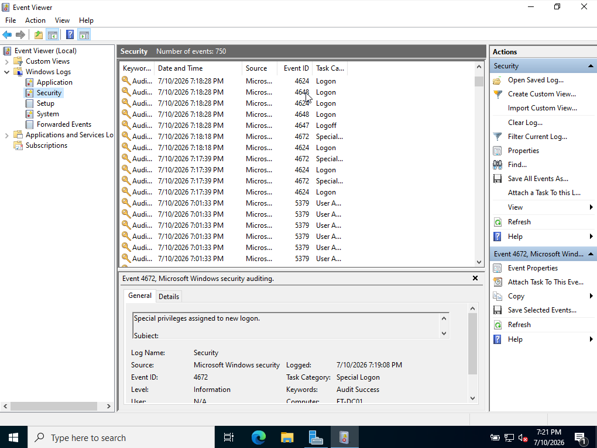
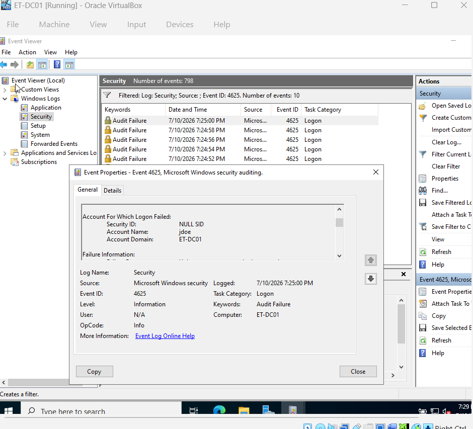

# Lab 03 - Windows Event Viewer & Security Log Analysis

## Objective
Navigate the Windows Event Viewer console on a Windows Server 2022 instance to analyze system, application, and security logs, focusing on identifying security events, auditing account failures, and understanding raw log data baseline metrics.

## Environment
- **Operating System:** Windows Server 2022 Standard Evaluation (Desktop Experience)
- **Virtualization Hypervisor:** Oracle VirtualBox
- **System Hostname:** ET-DC01

## Requirements & Scope
1. Locate and navigate the core Windows Logs (Application, Security, System).
2. Generate an intentional security event (Failed Login Attempt) to simulate an unauthorized access pattern.
3. Locate, isolate, and analyze the specific Event ID associated with authentication failures.
4. Filter log data to isolate specific operational metrics.

## Implementation Steps

### Phase 1: Navigating the Logging Architecture
1. Log into `ET-DC01` as the built-in Administrator.
2. Open the Run dialog (`Win + R`), type **`eventvwr.msc`**, and press **Enter** to launch the Event Viewer.
3. Expand **Windows Logs** in the left-hand console and review the total event counts for **Application**, **Security**, and **System** logs.
   > 📸 **SCREENSHOT #1:** Capture the Event Viewer console with the 'Security' log highlighted, showing the general list of audit events. (Save as `01-event-viewer-baseline.png`)

### Phase 2: Simulating an Adverse Security Event (Failed Logon)
1. Intentionally lock your Windows Server session (`Win + L`).
2. Click the screen to bring up the login prompt, select **Other User**, and type a fictitious username (e.g., `attacker` or `malicious_user`).
3. Type an incorrect password and press **Enter** to trigger an explicit authentication failure. Do this twice.
4. Log back into the server using your valid `Administrator` credentials.

### Phase 3: Log Isolation & Threat Hunting
1. Return to the **Event Viewer > Windows Logs > Security** log.
2. Click **Filter Current Log...** in the right-hand Actions pane.
3. In the "All Event IDs" box, type **`4625`** (The standard Windows Event ID for an explicit account logon failure). Click **OK**.
4. Double-click the top failure event in the filtered list to open its detailed properties.
   > 📸 **SCREENSHOT #2:** Capture the Event Properties window showing the specific details of Event ID 4625, making sure the target username (`attacker`) and logon type are visible. (Save as `02-failed-logon-audit.png`)

---

## Outcome
Successfully audited and evaluated the Windows Event Logging architecture on ET-DC01. By deliberately injecting simulated authentication failures (`attacker` account unauthorized login attempts), the system's defensive logging mechanisms were triggered. Utilizing the Event Viewer filtering capability, Event ID 4625 (Logon Failure) was isolated, capturing critical forensic metrics including the target account name, failure reason, and logon type.

## Lessons Learned
- **Event ID Familiarity:** Developed hands-on experience identifying standard Windows security event codes, recognizing that Event ID 4625 serves as a primary indicator of unauthorized access attempts or brute-force tracking.
- **Log Aggregation Baselines:** Observed the high volume of background security noise generated by standard Windows auditing, underscores the absolute necessity of query filtering and SIEM log enrichment to isolate true threats from baseline system behavior.
- **Forensic Footprints:** Analyzed the detailed metadata structure within Windows security events, gaining insight into how analysts track the source and context of internal compromise attempts.

## Screenshots
#### 1. Security Log Operational Architecture

#### 2. Isolated Event ID 4625 (Logon Failure Audit)

