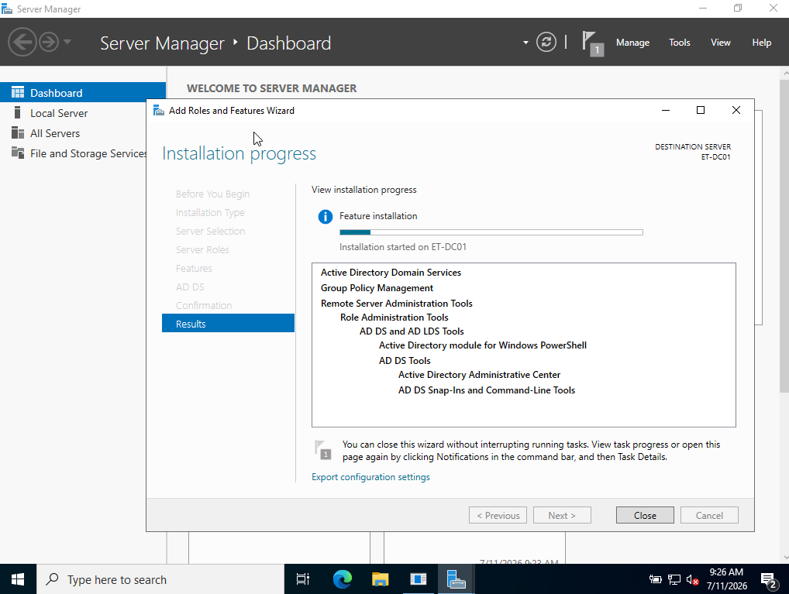
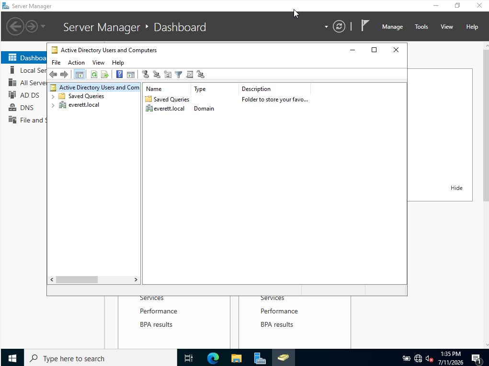

# Lab 05 - Active Directory Domain Services (AD DS) Deployment

## Objective
Install the Active Directory Domain Services (AD DS) role on ET-DC01 and promote the server to a primary Domain Controller, establishing the root forest identity for Everett Technologies.

## Environment
- **Operating System:** Windows Server 2022 Standard Evaluation
- **System Hostname:** ET-DC01
- **Domain Name:** everett.local

## Requirements & Scope
1. Install the AD DS Server Role using the Server Manager GUI.
2. Promote the server to a Domain Controller, provisioning a brand-new forest (`everett.local`).
3. Verify the domain architecture using Active Directory Users and Computers (ADUC).

## Implementation Steps

### Phase 1: Installing the AD DS Role
1. Log into `ET-DC01` as the local Administrator.
2. Open **Server Manager** (it usually launches automatically on startup).
3. On the main dashboard, click **Add roles and features**.
4. Click **Next** until you reach the **Server Roles** page.
5. Check the box for **Active Directory Domain Services**. A pop-up will appear; click **Add Features**, then click **Next**.
6. Click **Next** through the remaining screens and hit **Install**. 
   > 📸 **SCREENSHOT #1:** Capture the Installation Progress screen showing the AD DS role actively installing. (Save as `01-adds-role-install.png`)

### Phase 2: Promoting to a Domain Controller
1. Once the role installation succeeds, click the **Flag icon** (Notifications) at the top of Server Manager.
2. Click the blue link that says **Promote this server to a domain controller**.
3. Select **Add a new forest**.
4. Root domain name: Type **`everett.local`** and click Next.
5. Enter a Directory Services Restore Mode (DSRM) password (e.g., `Password123!`) and click Next.
6. Click **Next** through the DNS, NetBIOS, Paths, Review, and Prerequisites screens.
7. Click **Install**. The server will configure AD and automatically reboot when finished.

### Phase 3: Active Directory Verification
1. After the reboot, the login screen will look different. It should now say **`EVERETT\Administrator`**. Log in.
2. Press `Win + R`, type **`dsa.msc`**, and hit Enter to open **Active Directory Users and Computers**.
3. Expand `everett.local` on the left and click on the **Domain Controllers** folder.
4. Verify that `ET-DC01` is listed in the center pane.
   > 📸 **SCREENSHOT #2:** Capture the ADUC console showing ET-DC01 successfully registered as a Domain Controller. (Save as `02-aduc-verification.png`)

---

## Outcome
(To be completed after execution.)

## Lessons Learned
(To be completed after execution.)

## Screenshots
#### 1. AD DS Role Installation

#### 2. Domain Controller Verification (ADUC)

