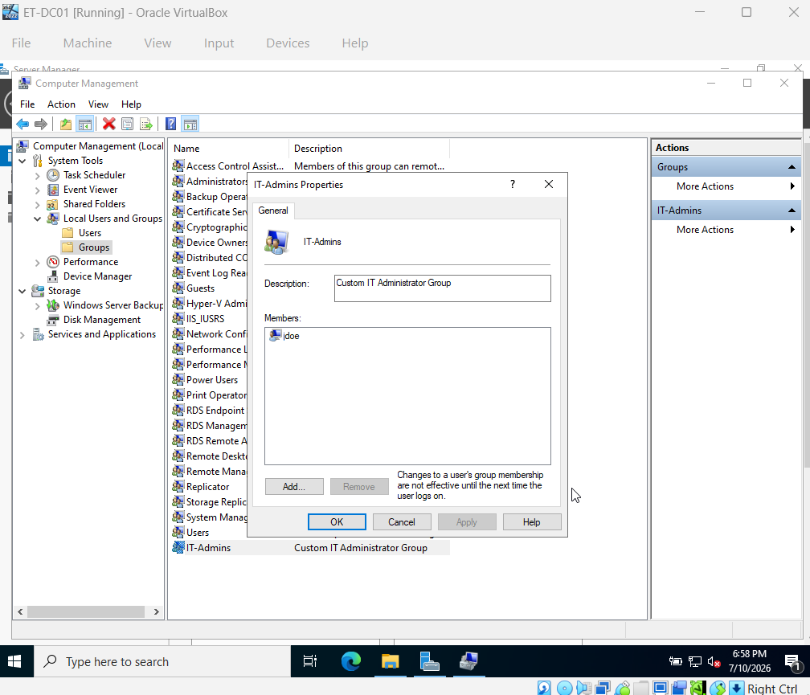
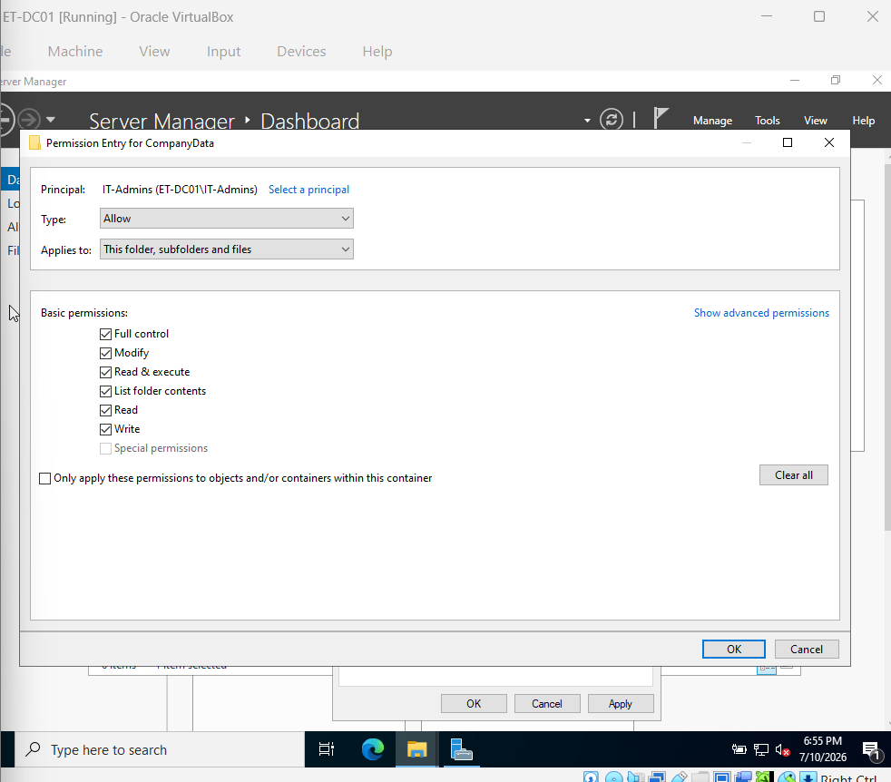
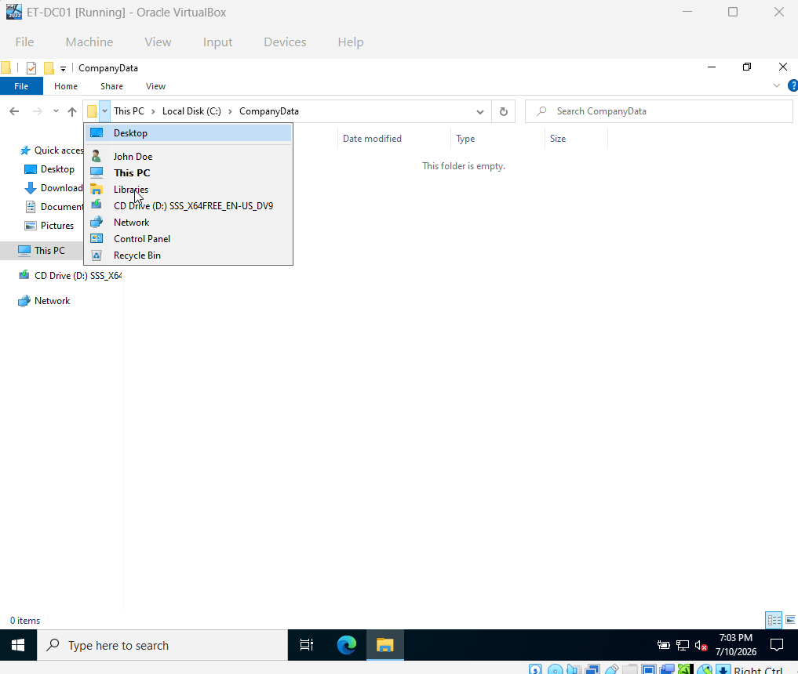
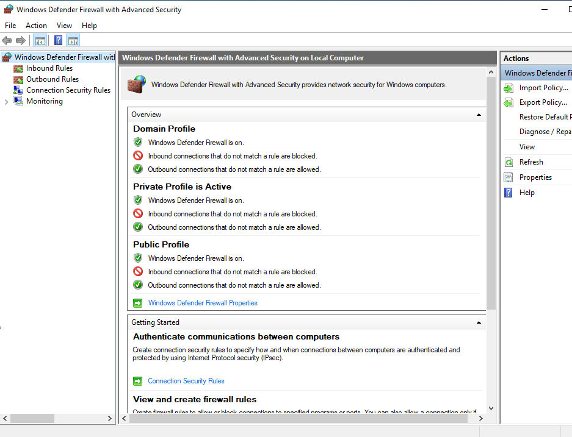
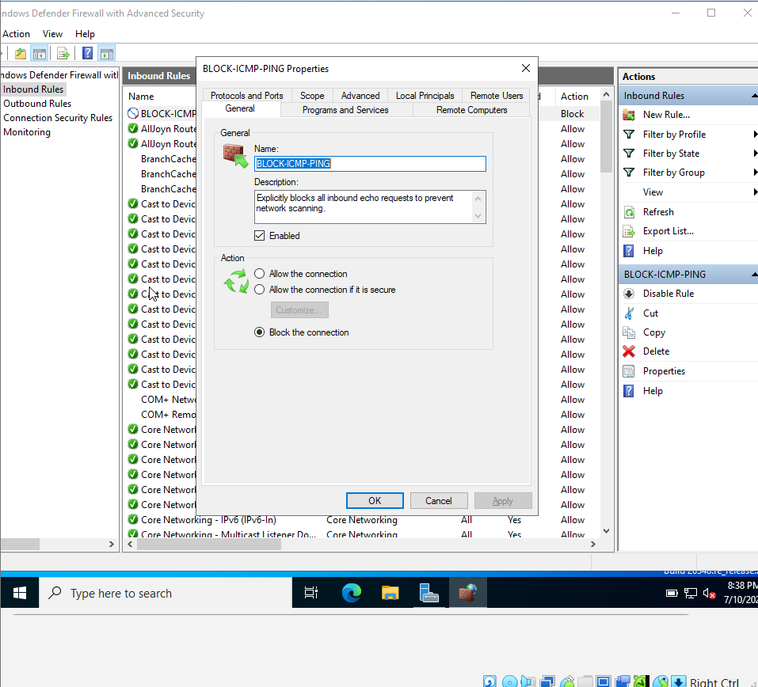

# Windows-Administration

Deployment documentation and standard operating procedures (SOPs) for the enterprise Windows Server infrastructure, featuring Server 2022 provisioning, centralized identity management (AD DS), security auditing, and advanced edge firewall configurations for Everett Technologies.

## 🛠️ Infrastructure Topology & Deployment Roadmap

## ✅ Phase 1: Windows Server 2022 Provisioning
- **Status:** ✅ Completed
- **Documentation:** View Phase 1 SOP
- **Description:** Provisioned virtual hardware containers, executed a custom Desktop Experience OS installation, and verified post-installation system metrics to establish the foundational server infrastructure for Everett Technologies.

### 📸 Phase 1 Quality Assurance (QA) Validation

*1. Virtual Machine Hardware Summary*

*2. Operating System Selection*

*3. Installation Success & System Metrics*

## ✅ Phase 2: Local Identity & Access Management (IAM)
- **Status:** ✅ Completed
- **Documentation:** View Phase 2 SOP
- **Description:** Managed local user accounts, administrative groups, and strict NTFS folder permissions using Windows utility consoles and PowerShell prior to the domain controller promotion.

### 📸 Phase 2 Quality Assurance (QA) Validation

*1. Administrative Group Membership*

*2. NTFS Security Permissions*

*3. Local User Verification*

## ✅ Phase 3: Security Auditing & Event Logging
- **Status:** ✅ Completed
- **Documentation:** View Phase 3 SOP
- **Description:** Configured and navigated system, application, and security logs to identify errors, track audit failures, and establish an incident response baseline for the enterprise environment.

### 📸 Phase 3 Quality Assurance (QA) Validation

*1. Event Viewer Security Baseline*

*2. Failed Logon Security Audit*

## ✅ Phase 4: Advanced Windows Firewall Configuration
- **Status:** ✅ Completed
- **Documentation:** View Phase 4 SOP
- **Description:** Established advanced inbound and outbound security rules to explicitly control network traffic flow, block unauthorized ICMP reconnaissance, and secure the edge boundaries.

### 📸 Phase 4 Quality Assurance (QA) Validation

*1. Firewall Ruleset Baseline*

*2. ICMP Block Rule Verification*

## ✅ Phase 5: Active Directory Domain Services (AD DS) Deployment
- **Status:** ✅ Completed
- **Documentation:** View Phase 5 SOP
- **Description:** Installed the AD DS role and promoted the server to a primary Domain Controller, replacing the local SAM database and establishing the centralized root forest identity (`et.local`).

### 📸 Phase 5 Quality Assurance (QA) Validation

*1. AD DS Server Role Installation*

*2. Domain Controller Verification (ADUC)*

## 📁 Repository Directory Structure
- **/SOPs** — Step-by-step deployment documentation, configuration guides, and validation walkthroughs.
- **/Screenshots** — Visual QA validation of successful command outputs, configurations, and topology designs.
- **/Scripts** — PowerShell automation, deployment, and provisioning scripts.
- **/Documentation** — High-level architecture, policy planning, and system metrics.
